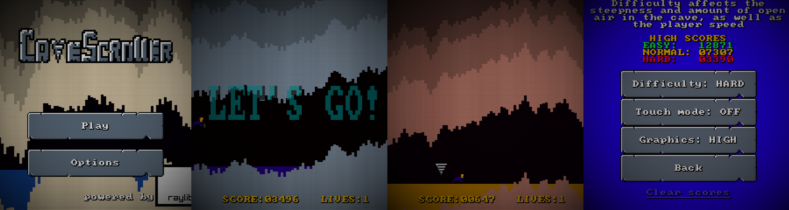

# 
Move around in a scrolling cave and avoid falling spikes. Entry for the [raylib 5K gamejam](https://itch.io/jam/raylib-5k-gamejam).
* [itch.io page](https://gtrxac.itch.io/cavescroller)

## Screenshots

## Gameplay
* Runs on Linux and Web (PC and Mobile)
* Avoid hitting falling spikes and the cave walls
* The cave gets harder to move around in as you progress
* 3 difficulty levels

## Controls
There are two control modes: keyboard mode and touch mode. Touch mode also works with the mouse, but keyboard is recommended on PC. You can change the control mode in Options.
* Use WASD or arrow keys to move around. Going below the map will kill you.
* In touch mode, tapping on the screen will move you to that position. In a way, this is easier than keyboard controls, so the game is faster to make up for that.
* If the level is impossible (the cave is steeper than the player movement speed, shouldn't happen in most cases), you can press R to generate a new level. This will reset your score and lives.
* Press ESC to go to the main menu.
* Press B in game to open the debug screen. In touch mode, there is a link in Options.
* Press G to quickly toggle low/high graphics.
* Whatever you do, don't press T when in game.

## Building

### Windows
1. Download [w64devkit](https://github.com/skeeto/w64devkit/releases):
* `w64devkit-x.x.x.zip` for 64-bit
* `w64devkit-i686-x.x.x.zip` for 32-bit
2. Extract w64devkit and run `w64devkit.exe`.
3. Inside w64devkit, go to the directory where you cloned cavescroller.
4. Run `./setup.sh` to build raylib.
5. Run `./build.sh` to compile the game.

### Cross compiling for Windows
1. Install `mingw-w64` using your package manager. Make sure `x86_64-w64-mingw32-gcc` is available from your command line.
2. Run `TARGET=Windows_NT ./setup.sh` to build raylib.
3. Run `TARGET=Windows_NT ./build.sh` to compile the game. 

### Linux
1. Run `./setup.sh` to build raylib.
2. Run `./build.sh` to compile the game.

### Web
Web building has only been tested on Linux. It should work on Windows without any major modifications.
1. If you're on Windows, follow the first 3 steps of the Windows building guide.
2. Run `TARGET=Web ./setup.sh` to build raylib.
3. Run `TARGET=Web ./build.sh -r` to compile and run the game. Opening the `index.html` won't work, a web server is needed and `-r` launches one.

### Android
1. Install [Java](https://openjdk.java.net/) if you haven't already. Make sure `JAVA` in your [`android/config.sh`](android/config.sh) points to the Java installation. If you're on Linux and installed Java through the package manager, you don't need to change the config.sh.
2. Run `TARGET=Android ./setup.sh` to install the SDK/NDK and build raylib. If you already have an SDK/NDK installation, you can set the paths to them in [`android/config.sh`](android/config.sh).
3. Run `TARGET=Android ./build.sh` to compile the game.
4. If you have a device with USB debugging enabled, it will try to install the APK on it. You can also transfer `cavescroller.apk` to the device and install it from a file manager.

## Credits
* Font: [IBM PC BIOS 8×8](https://int10h.org/oldschool-pc-fonts/fontlist/font?ibm_bios), (c) 2016-2020 VileR
* CSS: [mandar1jn/planet-clash](https://github.com/mandar1jn/planet-clash/blob/main/src/minshell.html#L33)
* Everything else made by me using [GIMP](https://www.gimp.org/), [mtPaint](http://mtpaint.sourceforge.net) and [rFXGen](https://raylibtech.itch.io/rfxgen).